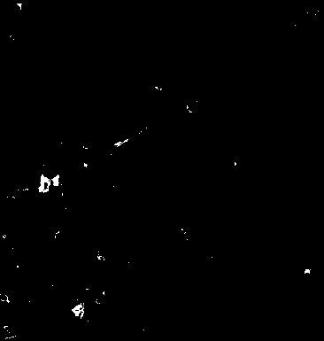

# Dead Tree Segmentation (RGB / NRG / MERGE)

This project implements a Python-based pipeline for segmentation of standing dead trees using aerial imagery.
The pipeline is based on classical image processing methods and allows evaluation of multiple segmentation strategies
without using machine learning models.

Three segmentation approaches are implemented:
- **NRG-based segmentation** (thresholding on NIR and Red channels),
- **RGB-based segmentation** (adaptive HSV thresholding),
- **MERGE segmentation**, combining RGB and NRG predictions.

The program generates binary masks, saves results to disk, computes evaluation metrics, and visualizes outputs.

---

## Dataset

The project uses an external dataset consisting of:
- RGB images,
- NRG images,
- ground-truth segmentation masks.

Dataset source (Kaggle):  
**https://www.kaggle.com/datasets/meteahishali/aerial-imagery-for-standing-dead-tree-segmentation?resource=download**

The dataset is **not included** in this repository due to size and license restrictions.

---

## Project Structure

```
project/
├── main.py                  # main entry point (pipeline orchestration)
├── io_utils.py              # configuration, argparse, paths, IO helpers
├── segmentation.py          # segmentation algorithms (RGB / NRG / MERGE)
├── metrics.py               # IoU and confusion-matrix metrics
├── visualization.py         # plots and visual previews
├── summary_utils.py         # final reporting and summaries
│
├── config_copy.yaml         # configuration template (DO NOT EDIT)
├── config.yaml              # user configuration (created by user)
├── README.md
├── requirements.txt
├── .gitignore
│
├── data/
│   ├── examples_rgb/        # small RGB subset for quick tests (default in config)
│   ├── examples_nrg/        # small NRG subset for quick tests (default in config)
│   ├── examples_gt_masks/   # GT masks for the example subset (default in config)
│   └── examples_results/    # optional: your saved example outputs (not required)
│   
└──  results/                 # generated outputs (created automatically; ignored by git)
   ├── RGB/
   ├── NRG/
   └── MERGE/

```

The default `config.yaml` points to the `data/examples_*` folders so you can run the project immediately on a small subset.
To run on the full dataset download it and update paths in `config.yaml`.

---

## Requirements

- Python **3.9 or newer**
- numpy
- scikit-image
- matplotlib
- pyyaml

It is strongly recommended to use a **virtual environment**.

---

## Virtual Environment Setup

Create a virtual environment:

```bash
python -m venv venv
```

Activate it:

**Windows**
```bash
venv\Scripts\activate
```

**Linux / macOS**
```bash
source venv/bin/activate
```

Install dependencies:

```bash
pip install -r requirements.txt
```

---

## Configuration System (IMPORTANT)

### `config_copy.yaml`

The file `config_copy.yaml` is a **template configuration file**.
It contains default paths and global parameters required by the program.

**This file must not be edited by the user.**

---

### Creating `config.yaml` (REQUIRED)

The working configuration file **does not exist by default** and must be created manually by the user.

Before running the program:

```bash
cp config_copy.yaml config.yaml
```

(Windows users can copy the file manually or use the `copy` command in CMD.)

Only `config.yaml` should be edited.  
The separation between `config_copy.yaml` and `config.yaml` prevents accidental modification
of base parameters while still allowing flexible customization.

---

### User-Configurable Options

In `config.yaml`, the user may modify:
- input data paths,
- output directory path,
- processing limits (number of images, visualization count),
- IoU threshold for evaluation.

The output directory can be freely changed, allowing results to be saved in any chosen location.
All paths are relative to the project root unless absolute paths are provided.

---

## Running the Program

After creating `config.yaml`, run the pipeline from the project root:

```bash
python main.py
```

During execution, the program:
1. Loads parameters from `config.yaml`,
2. Reads RGB, NRG, and ground-truth images,
3. Generates segmentation masks using three approaches,
4. Applies morphological post-processing,
5. Saves generated masks to the selected output directory,
6. Computes IoU and confusion-matrix statistics,
7. Displays example visualizations and metric plots.

The `results/` directory and its subfolders are created automatically during execution.

---

## Command-Line Overrides (Optional)

Selected parameters can be overridden at runtime without modifying `config.yaml`.

Examples:

Override number of processed images:
```bash
python main.py --all-limit 100
```

Override IoU threshold:
```bash
python main.py --iou-threshold 0.2
```

Override output directory:
```bash
python main.py --results-dir custom_results
```

Command-line arguments always **override values from `config.yaml`**.

---

## Output

For each input image, three binary masks (0/255) are saved:

- `NRG/` – NRG-based segmentation,
- `RGB/` – RGB-based segmentation,
- `MERGE/` – merged RGB + NRG segmentation.

The program also generates:
- IoU score distributions,
- TP / FP / FN statistics,
- summary counts of images exceeding the IoU threshold.

---

## Example Results

Example paths (replace with your own files):

### Input Images
- RGB image:  
  `data\examples_rgb\RGB_ar037_2019_n_06_04_0.png`

  <p align="center">
  
  <br>
  <em>RGB image</em>
</p>

- NRG image:  
  `data\examples_nrg\NRG_ar037_2019_n_06_04_0.png`

  <p align="center">
  
  <br>
  <em>NRG image</em>
</p>

### Ground Truth
- Mask:  
  `data\examples_gt_masks\mask_ar037_2019_n_06_04_0.png`

<p align="center">
  
  <br>
  <em>GT mask</em>
  </p>

### Generated Masks
- RGB-based mask:  
  `data\examples_results\RGB_example_1.png`

<p align="center">
  
  <br>
  <em>Generated RGB mask</em>
</p>

- NRG-based mask:  
  `data/examples_results/NRG_example_1.png`

<p align="center">
  
  <br>
  <em>Generated NRG mask</em>
</p>

- Merged mask:  
  `data\examples_results\Merge_example_1.png`
  <p align="center">
  
  <br>
  <em>Combination of RGB and NRG masks</em>
</p>
---

## Notes

- Input folders should contain corresponding images with matching filenames.
- The pipeline is intended for educational and experimental use.
- The configuration system is designed to protect base parameters from accidental edits.


